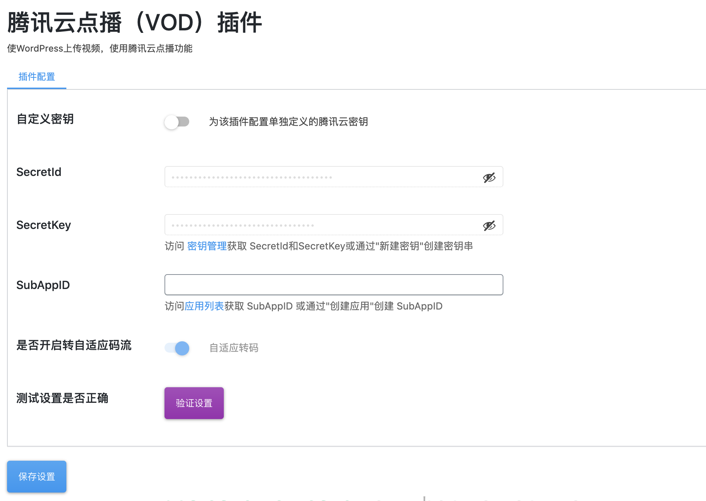

# 腾讯云点播插件

## 0.版本依赖

- 依赖 PHP 5.5+ 环境

- 如果有其它插件引用了 GuzzleHttp 库并低于 6.3.0 版本会引起插件冲突导致站点无法使用

## 1.插件介绍

> tencentcloud_vod插件是一款腾讯云研发的，提供给WordPress站长使用的官方插件。使WordPress能快捷使用腾讯云点播（VOD）产品功能的插件

| 标题       | 内容                                                                                                          |
| -------- | ----------------------------------------------------------------------------------------------------------- |
| 中文名称     | 腾讯云点播（VOD）插件                                                                                                |
| 英文名称     | tencentcloud_vod                                                                                            |
| 最新版本     | v1.0.4 (2022.08.10)                                                                                         |
| 适用平台     | [WordPress](https://wordpress.org/)                                                               |
| 适用产品     | [腾讯云点播（VOD）](https://cloud.tencent.com/product/vod)                                                         |
| GitHub项目 | [tencentcloud-wordpress-plugin-vod](https://github.com/Tencent-Cloud-Plugins/tencentcloud-wordpress-plugin-vod) |
| Gitee项目 | [tencentcloud-wordpress-plugin-vod](https://gitee.com/Tencent-Cloud-Plugins/tencentcloud-wordpress-plugin-vod) |
| 主创团队     | 腾讯云中小企业产品中心（SMB Product Center of Tencent Cloud）                                                            |

## 2.功能特性

- 支持在发帖时上传视频
- 用户观看视频不占用本站带宽

## 3.安装指引

### 3.1.部署方式一：通过GitHub部署安装

> 1. git clone https://github.com/Tencent-Cloud-Plugins/tencentcloud-wordpress-plugin-vod.git
> 2. 复制 tencentcloud-vod文件夹 到WordPress安装路径/wp-content/plugins/文件夹里面

## 4.使用指引

### 4.1.界面功能介绍

> 后台配置页面。配置介绍请参考下方的[名词解释](#_4-2-名词解释)

### 4.2.使用说明

> 保存云点播插件设置前，可以先点击验证设置，查看配置是否正确可用

> 启用云点播插件之后，在 wordpress 后台上传视频文件，会自动将视频文件上传至腾讯云点播，并将在后续播放时使用腾讯云点播的视频源，不消耗源站流量

> 包括 wmv, avi, flv, mov, mpeg, mp4, webm, mkv 等视频格式

### 4.3.名词解释

- **自定义密钥：** 插件提供统一密钥管理，既可在多个腾讯云插件之间共享SecretId和SecretKey，也可为插件配置单独定义的腾讯云密钥。
- **Secret ID：** 在[腾讯云API密钥管理](https://console.cloud.tencent.com/cam/capi)上申请的标识身份的 SecretId。
- **Secret Key：** 在[腾讯云API密钥管理](https://console.cloud.tencent.com/cam/capi)上申请的与SecretId对应的SecretKey。
- **SubAppID：** 在[腾讯云点播应用管理](https://console.cloud.tencent.com/vod/app-manage)上创建的应用ID。
- **转自适应码流：** 播放器根据当前带宽动态选择合适的码率播放、且支持更多格式的视频播放。开启后因需要时间转换码率，上传的视频无法立即播放，所需时间依视频长度、大小而定。默认开启且无法修改。详细解释参照[腾讯云文档](https://cloud.tencent.com/document/product/266/34071)

## 5.获取入口

| 插件入口   | 链接                                                                               |
| ------ | -------------------------------------------------------------------------------- |
| GitHub | [link](https://github.com/Tencent-Cloud-Plugins/tencentcloud-wordpress-plugin-vod) |
| gitee  | [link](https://gitee.com/Tencent-Cloud-Plugins/tencentcloud-wordpress-plugin-vod) |

## 6.FAQ

> 1. Q: 无法找到此视频兼容的源或者当前环境无法播放该视频。
>    A: 请确保上传视频前开启了“转自适应码流”选项。且浏览器在[浏览器/格式列表](https://cloud.tencent.com/document/product/266/14424) 中。

